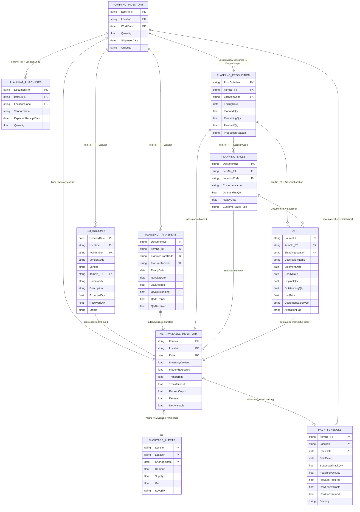

# Data Model — Category Manager Control Tower

## Key Insight: Two SKU Universes

Before looking at the joins, one structural fact drives everything in this model:

| Prefix | Meaning | Appears In |
|---|---|---|
| `RT*` | Raw / Bulk SKU — unprocessed commodity | cm_inbound, planning_inventory, planning_transfers |
| `FT*` | Finished / Packed SKU — packed, ready to sell | planning_sales, planning_production, sales |

The production step (`planning_production`) is the **bridge** — it consumes `RT*` raw material and outputs `FT*` finished SKUs. Every shortage alert and pack schedule recommendation ultimately traces back through this bridge.

---

## Entity Relationship Diagram



---

## Join Keys Reference

| Join | Left Table | Left Key | Right Table | Right Key | Type |
|---|---|---|---|---|---|
| Raw inventory ↔ Inbound | planning_inventory | ItemNo + Location | cm_inbound | Item No. + Location | 1:M |
| Raw inventory ↔ Transfers | planning_inventory | ItemNo + Location | planning_transfers | Item No. + Transfer-from Code | 1:M |
| Raw inventory ↔ Purchases | planning_inventory | ItemNo + Location Code | planning_purchases | Item No. + Location Code | 1:M |
| Raw ↔ Production (bridge) | planning_inventory | Location | planning_production | Location Code | 1:M |
| Production ↔ Sales (planning) | planning_production | Item No. + Location Code | planning_sales | Item No. + Location Code | 1:M |
| Production ↔ Sales (actuals) | planning_production | Item No. + Location Code | sales | Item No. + Shipping Location | 1:M |
| Planning sales ↔ Sales actuals | planning_sales | Document No. | sales | Source ID | 1:1 |

---

## Data Flow: From Source to Output

```
LAYER 1 — RAW MATERIAL POSITION
┌─────────────────────┐     ┌──────────────────────┐     ┌───────────────────────┐
│  planning_inventory  │     │     cm_inbound        │     │  planning_purchases   │
│  (RT* on-hand stock) │     │  (RT* inbound POs)   │     │  (RT* open POs)       │
│  ItemNo, Location,   │     │  Item No., Location,  │     │  Item No., Location,  │
│  WorkDate, Quantity  │     │  ExpectedQty, Status  │     │  ExpectedReceiptDate  │
└────────┬────────────┘     └──────────┬───────────┘     └──────────┬────────────┘
         │                             │                              │
         └─────────────────────────────┴──────────────────────────────┘
                                       │
                              JOIN on ItemNo + Location
                                       │
                                       ▼
                          ┌────────────────────────┐
                          │  Raw Material Position  │
                          │  On Hand + Expected In  │
                          │  - Already Committed    │
                          └────────────┬───────────┘
                                       │
                                       ▼
LAYER 2 — PRODUCTION BRIDGE (RT* → FT*)
                          ┌────────────────────────┐
                          │  planning_production    │
                          │  (FT* pack runs)        │
                          │  ItemNo_FT, Location,   │
                          │  Quantity, RemainingQty  │
                          └────────────┬───────────┘
                                       │
              Consumes RT* bulk  →  Outputs FT* finished cases
                                       │
LAYER 3 — TRANSFERS (RT* between facilities)
         ┌─────────────────────────────┘
         │    ┌───────────────────────┐
         │    │  planning_transfers   │
         │    │  Item No., From, To   │
         │    │  QtyShipped, InTransit│
         │    └──────────┬────────────┘
         │               │
         └───────────────┘
                         │
                         ▼
LAYER 4 — DEMAND
         ┌───────────────────────────────────────────┐
         │                                           │
┌────────┴───────────┐                   ┌───────────┴───────────┐
│  planning_sales     │                   │       sales            │
│  (FT* open orders)  │ ◄── DocumentNo ──► │  (FT* full order line) │
│  OutstandingQty     │   = Source ID     │  OriginalQty,          │
│  ReadyDate,         │                   │  OutstandingQty,       │
│  CustomerSalesType  │                   │  UnitPrice, Allocation │
└────────┬───────────┘                   └───────────┬───────────┘
         │                                           │
         └─────────────────────┬─────────────────────┘
                               │
                               ▼
LAYER 5 — NET AVAILABLE INVENTORY (calculated)
┌──────────────────────────────────────────────────────────────┐
│  NetAvailable = Inventory On Hand                             │
│              + Expected Inbound (cm_inbound)                 │
│              + Packed Output (planning_production)           │
│              + Transfers In (planning_transfers)             │
│              - Transfers Out (planning_transfers)            │
│              - Demand (planning_sales / sales)               │
└──────────────────────────────┬───────────────────────────────┘
                               │
               ┌───────────────┴───────────────┐
               │                               │
               ▼                               ▼
┌──────────────────────┐         ┌─────────────────────────┐
│   SHORTAGE ALERTS     │         │    PACK SCHEDULE         │
│  Where NetAvailable   │         │  Suggested pack qty to   │
│  < Safety Stock       │         │  cover the gap, checked  │
│  → Severity flagging  │         │  against raw material    │
│  → Customer allocation│         │  availability (Layer 1)  │
└──────────────────────┘         └─────────────────────────┘
```

---

## Notes on Data Gaps

The model above works end-to-end for shortage detection and customer allocation.
The pack schedule engine additionally requires three inputs **not yet in the raw files**:

| Missing Input | Blocks | Workaround |
|---|---|---|
| Raw material availability (lbs) | Pack feasibility check | Use planning_inventory Quantity as proxy (cases, not lbs) |
| SKU yield rate (cases/lb) | Raw lbs required calculation | Estimate from pack weight in Description field |
| Shelf life per SKU | JIT pack window | Default to 10 days until confirmed |
